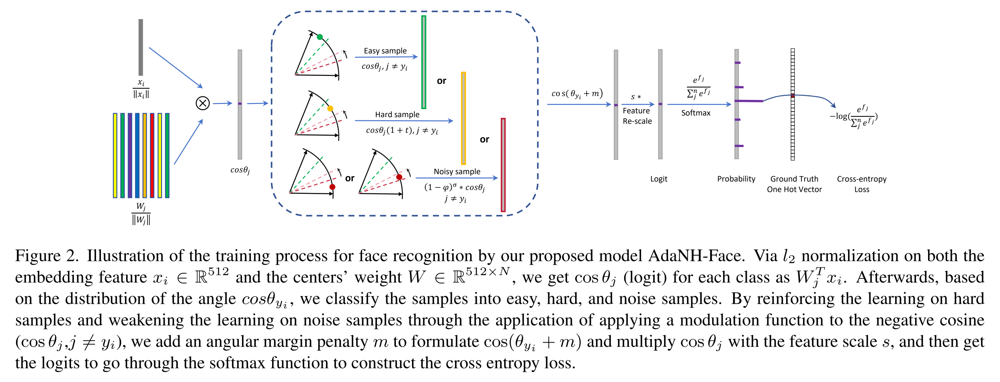

# RobustFace: Adaptive Mining of Noise and Hard Samples for Robust Face Recognitions

## Introduction
 we propose an updated deep face recognition model: RobustFace, and, 
 in comparison with the existing models, it has the feature that 
 training is proceeded with an adaptive noise and hard sample mining 
 loss function, which is designed to improve the robustness of deep 
 learning models in the presence of both closed-set and open-set 
 noises, enabling direct learning of more effective facial features 
 on large-scale noisy datasets. As shown in Fig.2, this can be 
 verified by observing not only the distribution of the angles between 
 noise and clean samples, but also the distribution of the current 
 class centre at different training stages. 
 


## Requirements

In order to enjoy the new features of pytorch, we have upgraded the pytorch to 1.9.0.  
Pytorch before 1.9.0 may not work in the future.

- `pip install -r requirement.txt`.

## Download Datasets or Prepare Datasets
[InsightFace](https://github.com/deepinsight/insightface/tree/master/recognition/_datasets_) provides a range of preprocessed labeled face datasets, including the MS1MV2, VGG2 etc. dataset used in RobustFace.

**For Training Datasets:**
- MS1MV2 (87k IDs, 5.8M images)
- [MS-Celeb-1M ](https://www.microsoft.com/en-us/research/project/ms-celeb-1m-challenge-recognizing-one-million-celebrities-real-world/) (100k IDs, 10M images)
- Glint360K (360K IDs, 18M images)

**For Validation Datasets:** 
- LFW (5749 IDs, 13,233 images, 6k Pairs)
- AgeDB-30 (570 IDs, 12,240 images, 7k Pairs)
- CFP-FP (500 IDs, 7k images, 7k Pairs)
- CALFW (5749 IDs, 13,233 images, 6k Pairs)
- CPLFW 5749 IDs, 13,233 images, 6k Pairs)

**For Testing Datasets:** 
- IJB (IJB-B, IJB-C)

**For Synthetic Noise Datasets:** 

To provide a comprehensive evaluation on the proposed RobustFace, we follow the work reported in [1] to apply two types of synthetic noise datasets, `close-set noise` and `open-set noise`, to the training
of the assessed models. While the close-set noise is introduced by randomly changing the labels of the facial images inside the training dataset, the open-set noise  is introduced by changing the label of those facial 
images that are not included inside the training dataset. For close-set noises, the labels of MS1MV2 samples are randomly flipped, and for open-set noises, `VGG2` is selected as the source, and `MS1MV2` samples are randomly 
replaced. 


## How to training
To train a model, run `train.py` with the path to the configs.
The example commands below show how to run distributed training.

```shell
python -m torch.distributed.launch --nproc_per_node=1 --nnodes=1 --node_rank=0 --master_addr="127.0.0.1" --master_port=12581 train.py configs/ms_celeb_1m_r100.py
```
If you want to train on a machine with multiple GPUs, you can achieve this by `--nproc_per_node`. For example, on a machine with 8 GPUs:
```shell
python -m torch.distributed.launch --nproc_per_node=8 --nnodes=1 --node_rank=0 --master_addr="127.0.0.1" --master_port=12581 train.py configs/ms_celeb_1m_r100.py
```

## Experimental results
The full experimental results will be presented after publication of the paper.

## Additional remarks
In addition to the baseline mentioned in the paper, we conducted more extensive experiments and included comparisons with other methods, such as Sub-center ArcFace (ECCV 2020). We will continue to update the experimental results.

| Method(%)               | Train Data  | LFW   | CALFW | AgeDB | CFP-FP | CPLFW | AVG   | IJBB  | IJBC  |
|-------------------------|-------------|-------|-------|-------|--------|-------|-------|-------|-------|
| Sub-center ArcFace,R50  | MS-Celeb-1M | 99.32 | 97.77 | 96.39 | 95.51  | 93.37 | 96.47 | 91.27 | 93.90 |
| RobustFace,R50          | MS-Celeb-1M | 99.76 | 98.41 | 97.55 | 95.87  | 93.33 | 96.98 | 91.30 | 94.02 |
| Sub-center ArcFace,R100 | MS1MV2      | 99.79 | 96.01 | 97.81 | 98.29  | 93.40 | 97.06 | 95.44 | 97.28 |
| RobustFace,R100         | MS1MV2      | 99.82 | 96.16 | 98.19 | 98.39  | 93.03 | 97.12 | 96.01 | 97.37 |


## Acknowledgements

This code is largely based on [InsightFace](https://github.com/deepinsight/insightface/). We thank the authors a lot for their valuable efforts.

## Reference
[1] Wu, Shijie, and Xun Gong. "BoundaryFace: A mining framework with noise label self-correction for Face Recognition." European Conference on Computer Vision. Cham: Springer Nature Switzerland, 2022.
